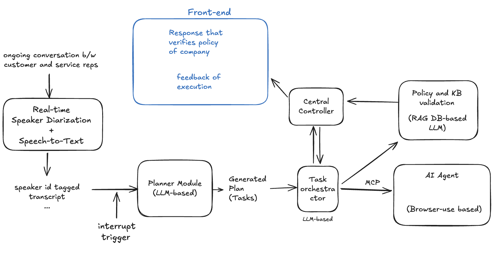

# 🤖📞 CallSense – AI-Powered Customer Support Agent

A real-time AI assistant system for customer support agents that transcribes live conversations and provides intelligent recommendations using RAG and AI agents.

## 🧠 System Architecture



## What it does

Transcribes ongoing conversations with speaker labels.
Uses LLMs to generate actionable tasks based on the dialog.
Verifies customer and order details by fetching from internal RAG-powered DB.
Validates refund eligibility based on company policies.
Executes actions through an AI agent using Playwright, such as issuing refunds or updating status.
Provides feedback and policy-verification responses in real time.

## Features

- 🎤 Real-time speech-to-text transcription
- 🤖 LLM-powered task generation from conversations
- 📚 RAG-based knowledge retrieval
- 🔄 Intelligent task orchestration
- 💬 Gradio-based frontend with live updates
- 🏗️ Modular, extensible architecture

:

## 🚀 Project Submission Info
🎯 This project was built as part of [AgentHacks](https://www.agenthacks.org) — a hackathon focused on pushing the boundaries of agent-based AI systems.

🛠️ Main Project Page: 🔗 [Weekday – Devpost Submission](https://devpost.com/software/weekday)

📽️ [Watch Demo Video on YouTube](https://www.youtube.com/watch?v=PIxKVSEkmiQ)


## Quick Start

### Prerequisites

- Python 3.10+
- [uv](https://github.com/astral-sh/uv) package manager

### Installation

1. Clone the repository:
```bash
git clone <your-repo-url>
cd customer-support-ai
```

2. Create and activate a virtual environment with uv:
```bash
uv venv
source .venv/bin/activate  # On Windows: .venv\Scripts\activate
```

3. Install dependencies:
```bash
uv pip install -r requirements.txt
```

4. (Optional) Set up OpenAI API key:
```bash
echo "OPENAI_API_KEY=your_api_key_here" > .env
```

### Running the Application

```bash
python main.py
```

The application will launch at `http://localhost:7860`

## Project Structure

```
├── main.py                 # Application entry point
├── components/            # Core system components
│   ├── speech_to_text.py  # Transcription service
│   ├── llm_service.py     # LLM task generation
│   ├── orchestrator.py    # Task routing logic
│   ├── rag_service.py     # Knowledge retrieval
│   ├── ai_agent.py        # AI agent actions
│   └── state_manager.py   # Central state control
├── frontend/              # UI components
│   └── gradio_app.py      # Gradio interface
├── data/                  # Knowledge base
│   ├── knowledge_base.json
│   └── policies.txt
└── utils/                 # Shared utilities
    └── models.py          # Data models
```

## Usage

1. **Start the application** - The system begins with mock transcription
2. **Monitor conversation** - Watch the real-time transcript in the left panel
3. **Trigger AI assistance** - Click "🤖 Generate AI Assistance" button
4. **Review recommendations** - AI suggestions appear in the right panel
5. **Execute or reject** - Choose to apply or dismiss the AI recommendations


## Development

### Using uv for package management

```bash
# Add a new dependency
uv pip install package-name

# Update requirements
uv pip freeze > requirements.txt

# Install from requirements
uv pip sync requirements.txt
```

### Running tests (when added)
```bash
uv run pytest
```

## Configuration

Edit `config.py` to modify:
- LLM model selection
- API endpoints
- File paths
- Server settings

## MVP Limitations

- Uses mock speech-to-text (no real audio processing)
- Mock AI agent actions (no actual MCP integration)
- File-based RAG (no vector database)
- Single conversation support

## Roadmap

- [ ] Integrate real speech-to-text API
- [ ] Implement MCP (Model Context Protocol)
- [ ] Add Playwright for web automation
- [ ] Vector database for RAG
- [ ] Multi-conversation support
- [ ] Authentication system
